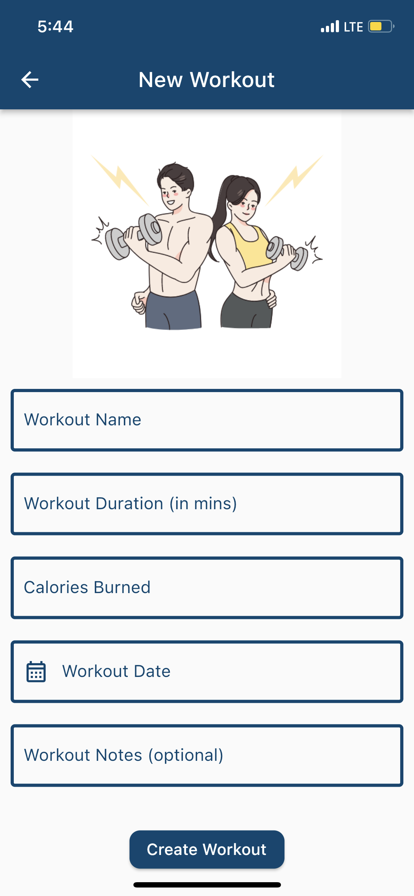
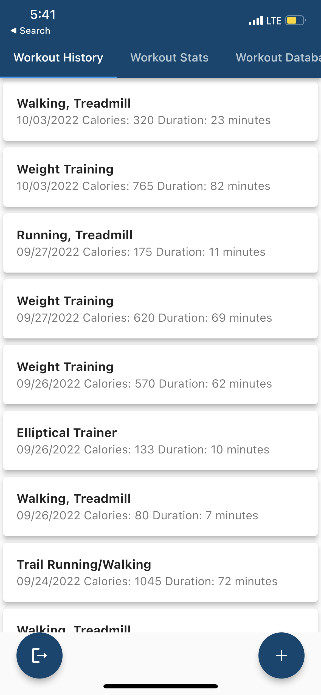
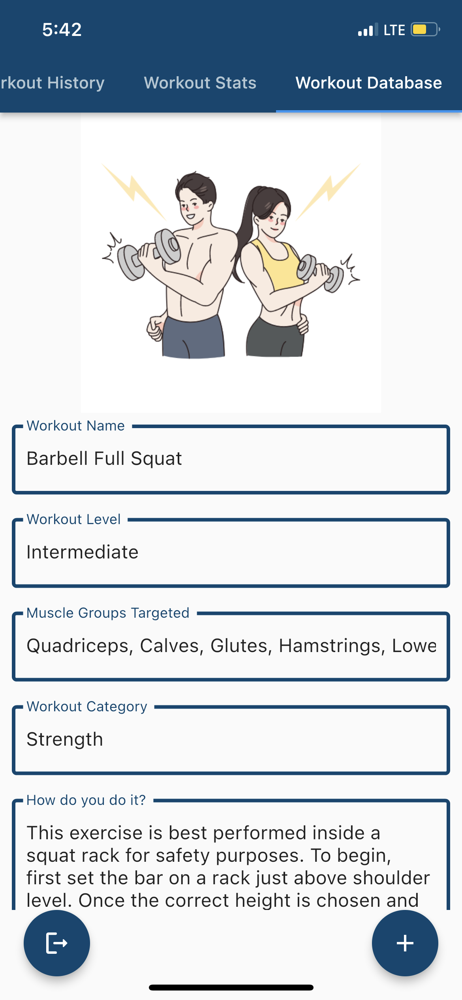

# NoFinishLineApp

NoFinishLineApp is a mobile application that allows users to track their workouts from a vast database of exercises. In the workout logging process, users can log their notes and calories burnt during the workout. The application also allows users to view their workout history and compare their progress over time. 

Also, for users new to the gym, the application provides a Workout Database which allows a user to search for a particular exercise. After selecting an exercise, the user can view the workout level, muscle groups targeted, and the know how to perform the exercise. Lastly, the application fetches the user's workout history and prepares statistics for the user to view, such as 
number of workouts logged, calories burnt, average workout duration, and the workout proportion split.

## Technologies Used

### Mobile Application

* Flutter
* Dart
* Firebase

### Backend and Database 

* Flask (Python) Framework for REST API performing CRUD operations
* AWS DynamoDB for storing user data and workout history
* Server setup on Heroku

The source code for the [backend repository](https://github.com/snarang181/NoFinishLineAPI) is available here.

## Screenshots

### Log a New Workout

### View Workout History

### Workout Database 

